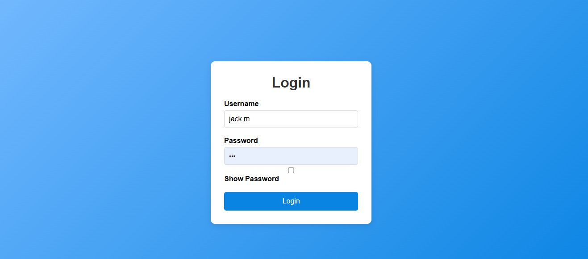
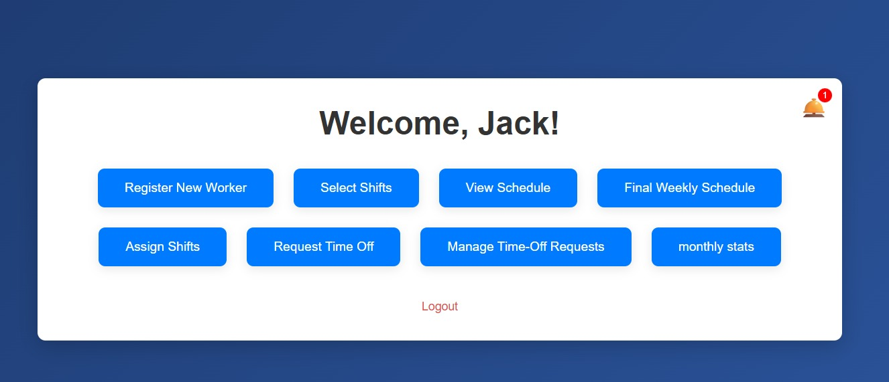
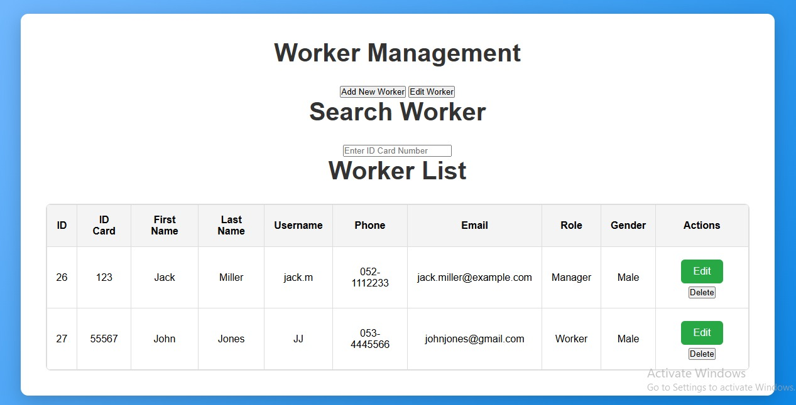
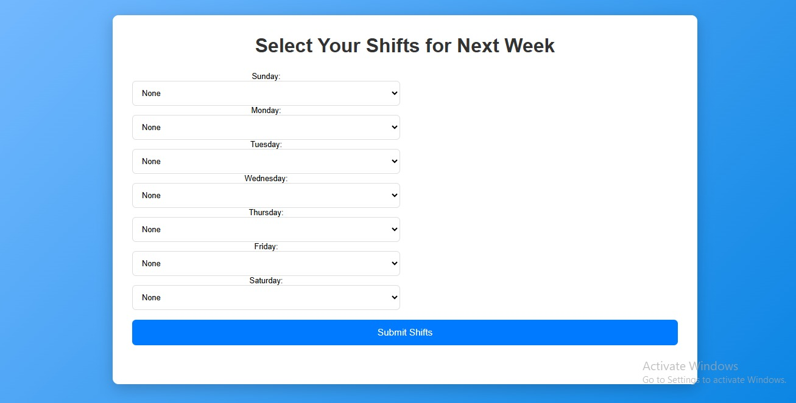
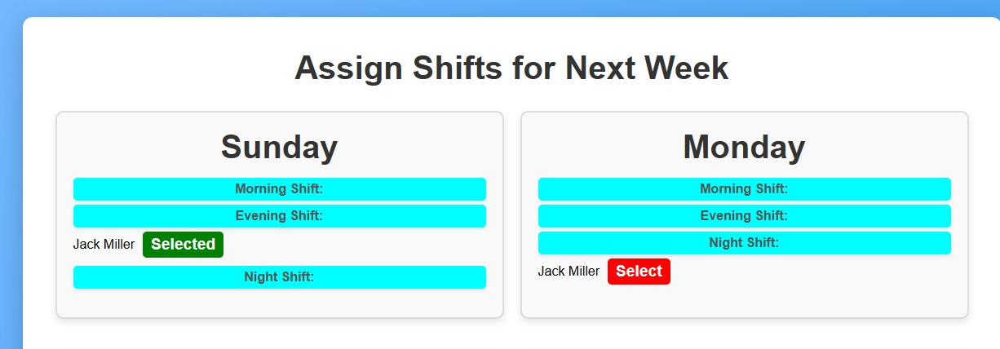
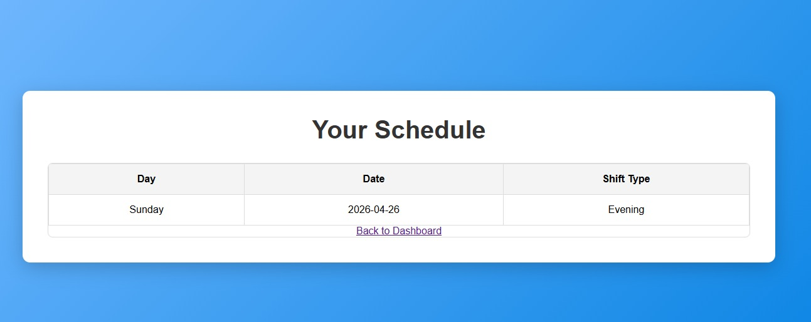
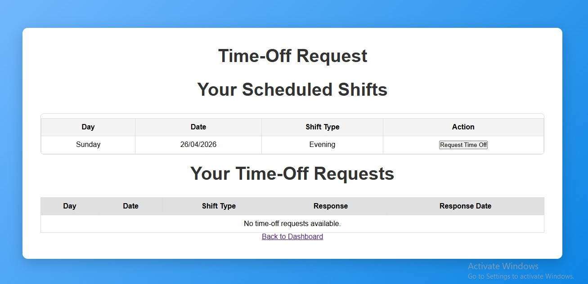
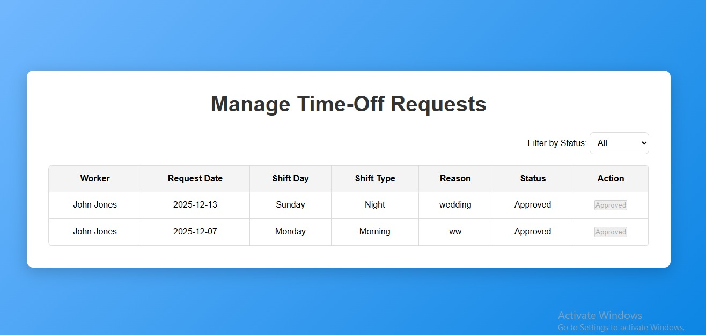
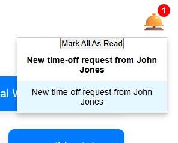
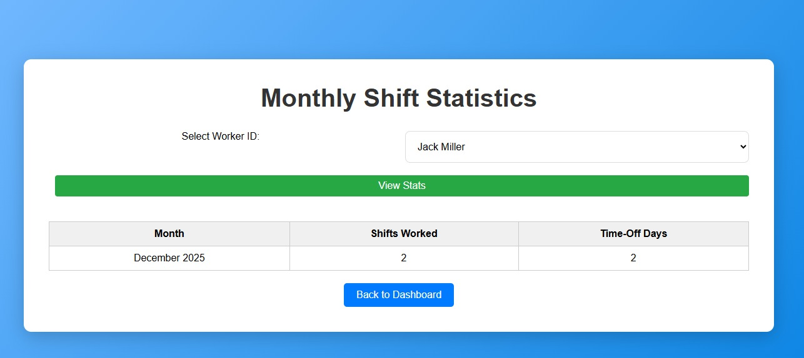

# 👋 Hi, I'm Mohamed Soliman

💻 Junior Software Developer | Full-Stack Enthusiast  
Passionate about building real-world applications and solving real-life problems with clean and efficient code.

---

## 🚀 About Me
- 🎓 Diploma in Practical Software Engineering  
- 🧠 Currently improving my skills in **React, Node.js, and Python**  
- ⚡ Fast learner with strong problem-solving mindset  
- 🤝 Team player with hands-on project experience  
- 🎯 Focused on building real-world systems and practical applications  

---

## 🏗️ Featured Projects

### 🧠 Work Schedule System (🔥 Main Project)

A full-stack web application for managing employee shifts, scheduling, and time-off workflows.

#### 🚀 Key Features:
- 👨‍💼 Manager dashboard for assigning shifts  
- 👷 Worker shift selection and availability system  
- 📅 Weekly schedule management  
- 🛑 Time-off request & approval system  
- 🔔 Notifications system  
- 📊 Monthly statistics tracking  
- 🔐 Role-based authentication (Manager / Worker)  

**Tech:** Node.js, Express, MySQL, EJS  

---

## 📸 Project Preview

### 🔐 Login Page

### 📊 Dashboard

### 👷 Worker Dashboard

### ✅ Select Shifts

### 📅 Assign Shifts

### 🗓️ Weekly Schedule

### 🛑 Time-Off Request Page

### 🛠️ Manage Time-Off Requests

### 🔔 Notifications

### 📈 Statistics

---

### 🐎 Horse Feeding Tracker
A web app to track daily feeding activities with timestamps and user logging  

**Tech:** Node.js, SQLite  

---

### 🍽️ Online Restaurant Menu
Dynamic restaurant menu with categories and clean UI  

**Tech:** HTML, CSS, JavaScript  

---

### 🛒 Family Grocery Tracker
A shared grocery list system with tracking and updates  

**Tech:** Node.js, EJS, MySQL  

---

## 💬 Ask Me About
HTML, CSS, JavaScript, Node.js, MySQL, C#, C++, Python, and building real-world applications

---

## ⚙️ Tech Stack

---

## 📊 GitHub Stats

---

## 🔗 Connect with Me
- 💼 [LinkedIn](https://www.linkedin.com/in/mohamed-hosen)
- 💻 [GitHub](https://github.com/MohamedSoliman233)

---

⭐ Thanks for visiting my profile!
